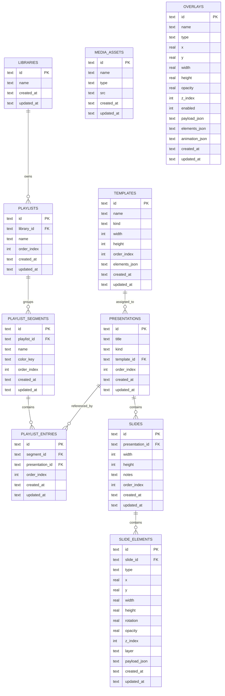

# OpenFIG Gem: Storage Model And Entity Relationships

This file documents the current persistence model used by Cast Interface, based on the domain types in `app/core/types.ts` and the SQLite schema and repository behavior in `app/database/store.ts`.

## Domain Relationship Summary

- A `library` owns many `playlists`.
- A `playlist` owns many `playlist_segments`.
- A `playlist_segment` owns many `playlist_entries`.
- A `playlist_entry` points to one `presentation`.
- A `presentation` owns many `slides`.
- A `slide` owns many `slide_elements`.
- A `template` can be assigned to many `presentations` through `presentations.template_id`.
- An `overlay` is a standalone global record and stores its own composed `elements_json`.
- A `media_asset` is a standalone global record.

## Important Modeling Notes

- `presentations`, `media_assets`, `overlays`, and `templates` are global content. They are not scoped to a `library`.
- `libraries` are currently used to scope playlists only.
- A `presentation` can appear in multiple playlists because `playlist_entries` references `presentations`.
- Within a single playlist, the repository enforces one placement per presentation by deleting existing entries in that playlist before inserting a new one.
- `slide_elements.payload_json` is polymorphic JSON. It stores text, image, video, shape, or group-specific data.
- `templates.elements_json` stores reusable slide elements as embedded JSON instead of normalized child rows.
- `overlays.elements_json` stores embedded slide-like elements instead of using the `slide_elements` table.
- Media usage is denormalized: image/video elements point to asset paths in `payload.src`, not to `media_assets.id`.

## SQLite Storage Model

### `libraries`

- `id` TEXT PRIMARY KEY
- `name` TEXT NOT NULL
- `created_at` TEXT NOT NULL
- `updated_at` TEXT NOT NULL

### `playlists`

- `id` TEXT PRIMARY KEY
- `library_id` TEXT NOT NULL
- `name` TEXT NOT NULL
- `order_index` INTEGER NOT NULL DEFAULT 0
- `created_at` TEXT NOT NULL
- `updated_at` TEXT NOT NULL
- FK `library_id -> libraries.id`

### `playlist_segments`

- `id` TEXT PRIMARY KEY
- `playlist_id` TEXT NOT NULL
- `name` TEXT NOT NULL
- `color_key` TEXT
- `order_index` INTEGER NOT NULL
- `created_at` TEXT NOT NULL
- `updated_at` TEXT NOT NULL
- FK `playlist_id -> playlists.id`

### `playlist_entries`

- `id` TEXT PRIMARY KEY
- `segment_id` TEXT NOT NULL
- `presentation_id` TEXT NOT NULL
- `order_index` INTEGER NOT NULL
- `created_at` TEXT NOT NULL
- `updated_at` TEXT NOT NULL
- FK `segment_id -> playlist_segments.id`
- FK `presentation_id -> presentations.id`

### `presentations`

- `id` TEXT PRIMARY KEY
- `title` TEXT NOT NULL
- `kind` TEXT NOT NULL DEFAULT `canvas`
- `template_id` TEXT NULL
- `order_index` INTEGER NOT NULL DEFAULT 0
- `created_at` TEXT NOT NULL
- `updated_at` TEXT NOT NULL
- Logical reference `template_id -> templates.id`

### `slides`

- `id` TEXT PRIMARY KEY
- `presentation_id` TEXT NOT NULL
- `width` INTEGER NOT NULL
- `height` INTEGER NOT NULL
- `notes` TEXT NOT NULL DEFAULT `''`
- `order_index` INTEGER NOT NULL
- `created_at` TEXT NOT NULL
- `updated_at` TEXT NOT NULL
- FK `presentation_id -> presentations.id`

### `slide_elements`

- `id` TEXT PRIMARY KEY
- `slide_id` TEXT NOT NULL
- `type` TEXT NOT NULL
- `x` REAL NOT NULL
- `y` REAL NOT NULL
- `width` REAL NOT NULL
- `height` REAL NOT NULL
- `rotation` REAL NOT NULL
- `opacity` REAL NOT NULL
- `z_index` INTEGER NOT NULL
- `layer` TEXT NOT NULL DEFAULT `content`
- `payload_json` TEXT NOT NULL
- `created_at` TEXT NOT NULL
- `updated_at` TEXT NOT NULL
- FK `slide_id -> slides.id`

### `media_assets`

- `id` TEXT PRIMARY KEY
- `name` TEXT NOT NULL
- `type` TEXT NOT NULL
- `src` TEXT NOT NULL
- `created_at` TEXT NOT NULL
- `updated_at` TEXT NOT NULL

### `overlays`

- `id` TEXT PRIMARY KEY
- `name` TEXT NOT NULL
- `type` TEXT NOT NULL
- `x` REAL NOT NULL
- `y` REAL NOT NULL
- `width` REAL NOT NULL
- `height` REAL NOT NULL
- `opacity` REAL NOT NULL
- `z_index` INTEGER NOT NULL
- `enabled` INTEGER NOT NULL
- `payload_json` TEXT NOT NULL
- `elements_json` TEXT NOT NULL DEFAULT `[]`
- `animation_json` TEXT NOT NULL
- `created_at` TEXT NOT NULL
- `updated_at` TEXT NOT NULL

### `templates`

- `id` TEXT PRIMARY KEY
- `name` TEXT NOT NULL
- `kind` TEXT NOT NULL
- `width` INTEGER NOT NULL
- `height` INTEGER NOT NULL
- `order_index` INTEGER NOT NULL DEFAULT 0
- `elements_json` TEXT NOT NULL DEFAULT `[]`
- `created_at` TEXT NOT NULL
- `updated_at` TEXT NOT NULL

## Entity Relationship Diagram

## Storage Gaps To Be Aware Of

- `presentations.template_id` is indexed and used like a foreign key, but the schema does not currently declare a database-level FK constraint.
- `media_assets` are not relationally linked to `slide_elements` or `overlays`; the connection exists only through file-path strings inside JSON payloads.
- `overlays` duplicate summary fields (`type`, `x`, `y`, `width`, `height`, `opacity`, `z_index`, `payload_json`) that are derived from the highest z-index element in `elements_json`.
- `group` slide elements nest child elements inside `payload_json.children`, which creates a second level of embedded composition outside normalized tables.
